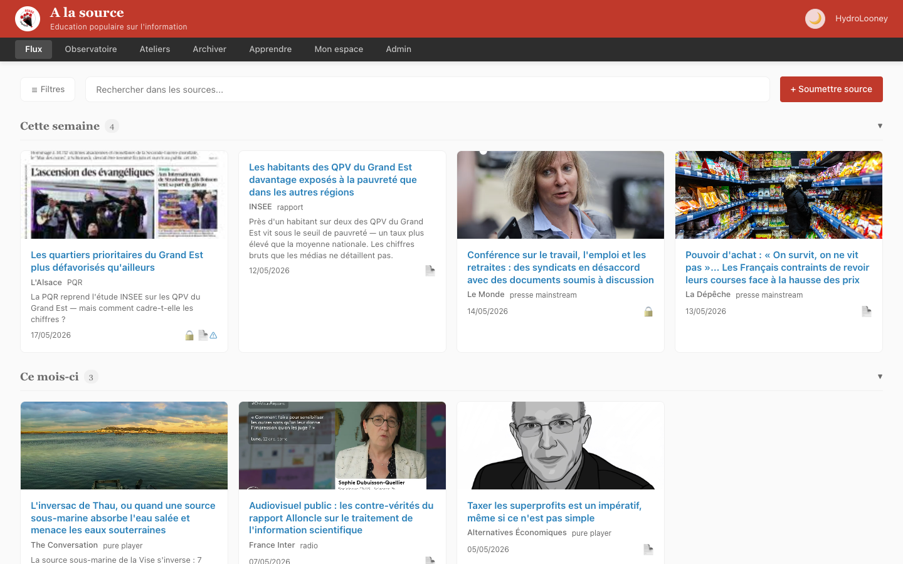
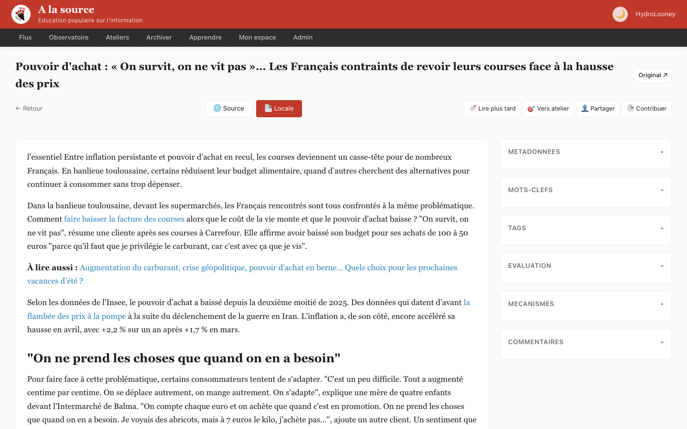
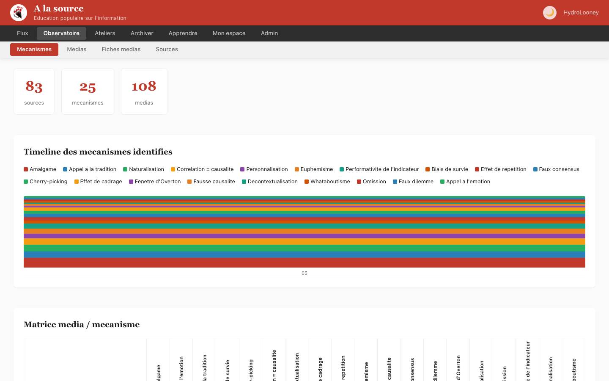
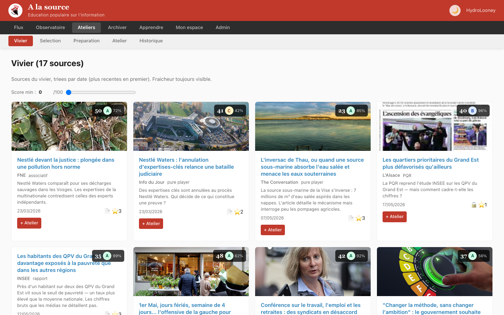

# À la source

**Outil d'éducation populaire sur l'information**, porté par [Rouge Coquelicot](https://rouge-coquelicot.fr).

> Développer le sens critique, ensemble. Pas dénoncer les médias, mais comprendre comment l'information est construite.

---

## Pourquoi cet outil ?

Au sein de Rouge Coquelicot, l'idée d'ateliers « À la source » a germé d'un constat simple : on partage beaucoup d'articles entre nous, on s'indigne, on commente — mais on prend rarement le temps de décortiquer *comment* une information est construite. Quels mécanismes sont à l'œuvre ? Quel cadrage ? Quels implicites ?

L'objectif était de créer un format d'atelier collectif où un groupe découvre une source choisie ensemble et l'analyse méthodiquement — pas pour dénoncer tel ou tel média, mais pour développer le réflexe de lire autrement.

Pour préparer ces ateliers, il fallait un outil : stocker les sources candidates, les évaluer collectivement, identifier les mécanismes informationnels, archiver les contenus contre le linkrot, et structurer un pipeline de sélection. J'ai d'abord cherché parmi les solutions existantes — Linkwarden, Wallabag, Shaarli — mais aucune ne correspondait à cet usage (voir [pourquoi](#pourquoi-pas-linkwarden-ou-wallabag-ou-shaarli-)). Ces outils archivent des liens ; nous, nous voulions structurer une démarche pédagogique collective *autour* de ces liens.

D'où **À la source** : une application web légère, autohébergée, construite sur mesure pour le workflow associatif d'éducation populaire à l'information. Et au-delà des ateliers, l'outil sert au quotidien de plateforme de veille collaborative pour les membres de l'association.

---

## Ce que permet l'application

### Veille collaborative (Flux)



La page d'accueil est un flux partagé de sources, alimenté par tous les membres.

- **Soumission URL-first** : coller une URL, tout le reste est auto-récupéré (titre, auteur, média, mots-clés, image, accroche, archive)
- Vignettes enrichies avec badges (paywall, archive locale, évaluations, commentaires)
- Groupement temporel, filtres par média/tag/type
- Chaque membre peut soumettre, commenter, recommander

### Lecture et analyse (Lire)



Le cœur de l'application : une page de lecture intégrée avec analyse collaborative en sidebar.

- **Reader intégré** : lecture de la copie locale (Readability, markdown, PDF) ou de la source originale
- **Sidebar interactive** : métadonnées, mots-clés, tags, évaluation, mécanismes identifiés, commentaires
- Actions rapides : lire plus tard, proposer pour un atelier, recommander à un membre, partager sur Discord

### Identification des mécanismes

Chaque membre peut repérer et documenter les mécanismes informationnels à l'œuvre dans une source.

- 25 mécanismes de référence classés par famille (manipulation par les chiffres, arguments fallacieux, biais de cadrage, procédés discursifs, biais structurels)
- Identification collaborative avec justification et extrait
- Fiches pédagogiques avec exemples et questions guidées

### Observatoire



Un tableau de bord collectif qui agrège les analyses de tous les membres.

- Timeline des mécanismes identifiés
- Matrice média × mécanisme (heatmap)
- Indice de confiance par média (calcul automatique depuis les évaluations)
- Fiches médias détaillées (propriétaire, ligne éditoriale, statistiques)
- Top des sources les plus évaluées

### Pipeline atelier



Le pipeline complet pour préparer, animer et documenter un atelier d'éducation populaire.

- **Vivier** : sources proposées, triées par date, filtrables par score (60 % pédagogie / 40 % écho)
- **Sélection** : l'animateur·ice compose la shortlist pour la séance
- **Préparation** : questions guidées, mécanismes pressentis, durée estimée par source
- **Atelier en cours** : projection plein écran, saisie du compte-rendu
- **Export PDF** : version imprimable de l'atelier (page de sélection + sources + analyses)

### Archivage anti-linkrot

Les articles disparaissent, les paywalls se ferment. L'archivage local garantit que les sources restent lisibles.

- Extraction automatique (Mozilla Readability + règles FTR par site)
- 65 sites français configurés (presse nationale, PQR, pure players, radio/TV)
- Détection automatique des paywalls et archives partielles
- Upload manuel possible (markdown, PDF, HTML)

### Espace personnel

- Lectures sauvegardées, recommandations reçues
- Chaînes partenaires (YouTube, podcasts)

### Intégration Discord (prévue)

- Copie rapide pour partage dans un canal Discord
- Bot de notification (à venir)

---

## Pourquoi pas Linkwarden, ou Wallabag, ou Shaarli ?

La question nous a été posée par un membre : « pourquoi coder notre propre outil plutôt que prendre Linkwarden ? ». Après avoir vérifié, la réponse est claire : ces outils ne couvrent pas notre usage.

| Critère | Linkwarden / Wallabag / Shaarli | À la source |
|---------|-------------------------------|-------------|
| **Objectif** | Archiver des liens personnels | Éducation populaire collective |
| **Mécanismes** | Inexistant | 25 mécanismes, fiches, identification collaborative |
| **Évaluation multi-critères** | Non | Score pédagogie + écho, multi-évaluateurs |
| **Pipeline atelier** | Non | Vivier → Sélection → Préparation → Atelier → CR |
| **Observatoire** | Non | Timeline, matrice, confiance média |
| **Rôles** | Admin/user | Membre / Animateur·ice / Admin |
| **Export atelier PDF** | Non | Oui |
| **Analyse collaborative** | Non | Commentaires typés, questions guidées |
| **Anti-linkrot spécialisé** | Oui (générique) | Oui + règles par site (65 sites FR) |

**En résumé** : les outils de bookmarking archivent des liens. **À la source** structure une démarche pédagogique collective autour de ces liens. Ce n'est pas la même chose.

---

## Installation

```bash
# Prérequis : Node.js >= 22
npm install

# Initialiser la base de données
npm run init-db

# Développement (serveur + client avec HMR)
npm run dev

# Production
npm run build
npm start
```

L'application tourne sur `http://localhost:3031`.

En développement, le client Vite tourne sur le port 5173 avec proxy vers le serveur.

### Variables d'environnement

| Variable | Défaut | Description |
|----------|--------|-------------|
| `PORT` | 3031 | Port du serveur |
| `NODE_ENV` | development | `production` active le serve statique |

---

## Architecture

```
a-la-source/
├── server/          ← API Express + TypeScript
│   └── src/
│       ├── index.ts
│       ├── routes/  (sources, tags, évaluations, ateliers, auth, médias, mécanismes, contenus)
│       ├── lib/     (db, auth, score, readability, opengraph, ftr-site-config)
│       └── db/      (schéma, seed, migrations)
├── client/          ← React 19 + Vite 6 + TypeScript
│   └── src/
│       ├── pages/   (Flux, Lire, Observatoire, Ateliers, Archiver, MonEspace, Apprendre)
│       ├── components/
│       │   ├── layout/    (Header)
│       │   ├── reader/    (Reader, MarkdownReader, PdfReader, ReadabilityReader)
│       │   ├── sidebar/   (MetadataPanel, TagsPanel, MecanismesPanel, EvaluationPanel, CommentairesPanel)
│       │   ├── cards/     (SourceCard)
│       │   └── forms/     (SubmitSource, EvaluerForm)
│       ├── store/   (Zustand : useAuth, useUI)
│       └── api/     (client type-safe)
├── db/              ← SQLite (WAL mode)
└── uploads/         ← Copies locales (PDF, markdown)
```

### Stack technique

| Couche | Choix | Justification |
|--------|-------|---------------|
| Frontend | React 19 + Vite 6 + TypeScript | Écosystème, composants, HMR |
| State | Zustand | 3 Ko, pas de boilerplate |
| Backend | Express + better-sqlite3 | Simple, performant, < 100 utilisateurs |
| BDD | SQLite WAL | Zéro config, backup triviale |
| Archivage | Readability + jsdom + FTR | Extraction intelligente par site |
| Auth | SSO YunoHost (header Remote-User) | Zéro mot de passe à gérer |
| Déploiement | YunoHost | Autohébergé, un seul process |

---

## Navigation

L'interface s'organise en 3 niveaux de header :

```
┌─────────────────────────────────────────────────────────────┐
│ H0 — Bandeau Rouge Coquelicot (logo + titre)               │
├─────────────────────────────────────────────────────────────┤
│ H1 — Navigation principale                                 │
│   Flux | Observatoire | Ateliers | Archiver | Apprendre    │
├─────────────────────────────────────────────────────────────┤
│ H2 — Sous-navigation contextuelle (selon la page)          │
│   ex : Mécanismes | Médias | Fiches médias | Sources       │
└─────────────────────────────────────────────────────────────┘
```

---

## Déploiement YunoHost

L'application est conçue pour être déployée sur YunoHost :

- Authentification par SSO (header `Remote-User`)
- Un seul process Node.js, un seul port
- Base SQLite locale (pas de SGBD externe)
- Build statique servi par Express en production

---

## Contribution

Le projet est porté par Rouge Coquelicot. Les contributions sont les bienvenues :

- Signaler un bug : ouvrir une issue
- Proposer un mécanisme : PR sur `server/src/db/seed.ts`
- Ajouter un site FTR : PR sur `server/src/lib/ftr-site-config.ts`

---

## Licence

CC-BY-NC-SA 4.0 — Rouge Coquelicot
